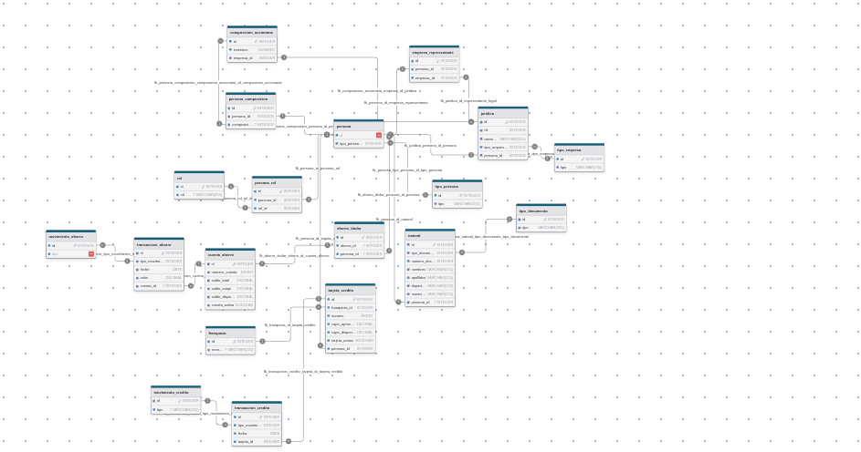
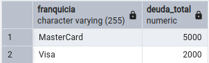
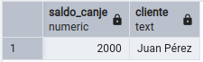
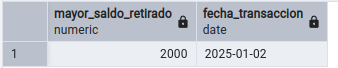
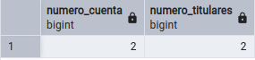
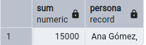
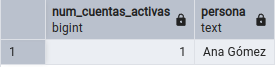

# Prueba técnica Skandia

## 1. Conceptos basicos de programación

### A.¿Qué es la programacion Orientada a Objetos (POO)?
La programación orientada a objetos (POO) es un paradigma (forma) de programación, la cual permite convertir cualquier elemento de la realidad (objetos, personas, animales, etc) en código, siguiendo principios y pilares de este paradigma. Uno de los objetivos principales de este paradigma es para evitar escribir codigo repetitivo en diferentes partes de un programa, la POO se caracteriza por tener cuatro pilares fundamentales que son:
- **Abstracción**
- **Herencia**
- **Polimorfismo**
- **Encapsulamiento**
### B.¿Cuál es la diferencia entre una clase y una interfaz?
La clase y la interfaz son dos estructuras de datos usadas con bastante frecuencia en la POO, estas estructuras de datos presentan algunas diferencias importantes: 
- **Clase**: es una plantilla o un modelo, que implementa un conjuto de caracteristicas (atributos y metodos), lo que permite instanciar o crear objetos con base a esa plantilla.
- **Interfaz**: es una estructura de datos que permite definir una serie de metodos o comportamientos sin especificar exactamente como se comportan estos metodos, sirve principalmente como un contrato que obliga a las clases que la implementan a implementar los métodos especificados.

Una clase tiene métodos implementados, una interfaz solo tiene métodos declarados sin ningun tipo de implementación.
### C.¿Cuál es la diferencia entre un método estático y uno no estático?
Los métodos no estaticos requieren instanciar un objeto para poder ser usados o accedidos. A diferencia de los estaticos que pueden ser llamados directamente utilizando la clase, es decir si yo tengo la clase persona y tengo un método getNombre, para poder usar este metodo debo primero instanciar un objeto de esta clase, pero si tengo un método static saludo, puedo directamente llamar este metodo sin necesidad de crear un objeto de la clase.
### D.¿Qué es un cilco de vida de Software?
El ciclo de vida del software es todo el proceso o las fases que estan involucradas al desarrollar una aplicación, desde que se hace el levantamineto de los requerimientos hasta la fase final de la aplicación funcionando, el ciclo de vida del software se compone principalmente de: 
1. levantamiento de requerimientos 
2. diseño de software implementación 
3. pruebas 
4. despliegue
5. mantenimiento.
Existen tambien varios modelos del cliclo de vida de software como el modelo ágil, modelo en cascada, modelo iterativo, que organizan estas etapas de diferente manera, segun la necesidad del proyecto.
### E.¿Cuál es la diferencia entre throw y throw ex dentro de un catch?
En el bloque tryCatch, abmos se utilizan para el manejo de errores, las diferencias son:

- **throw**: No hace modiciaciones a la excepción que ocurrió, esto hace que la exepcion que se muestre sea tal cual la que se lanzo y facilita el seguimiento del error.

- **throw ex**: Personaliza la excepción original, sobrescribuendo la informacion inicial, esto puede dar un mensaje mas personalizado del error pero puede dificultar el seguimiento inicial del error, al perder el contexto inicial.

## 2. Algoritmos:

### A. Imprimir los números del 1 al 100 con condiciones especiales
**Requisitos**:
- Si el número es divisible por 3, se debe imprimir “Bin”.
- Si el número es divisible por 5, se debe imprimir “Go”.
- Si se cumplen ambas condiciones (divisible por 3 y por 5), se debe imprimir. “Bingo!”
#### Respuesta:

```java
public class BinGO {
    static public void Bingo() {
        for (int i = 1; i <= 100 ; i++) {
            if ( i % 3 == 0 && i % 5 == 0){
                System.out.println(i + " Bingo!");
            } else if(i % 3 == 0){
                System.out.println(i +" Bin");
            } else if (i % 5 == 0) {
                System.out.println(i + " Go");
            }
        }
    }
}
```
### B.Escriba un algoritmo para calcular e imprimir los primeros 50 números primos.
```java
import java.util.ArrayList;
import java.util.List;

public class Primos {
    static public void primos() {
        List<Integer> listaPrimos = new ArrayList<>();
        int numero = 1;
        boolean stop = false;
        while (!stop) {
            int cont = 0;
            for (int i = 1; i <= numero; i++) {
                if (numero % i == 0) {
                    cont++;
                }
            }
            if (cont <= 2) {
                listaPrimos.add(numero);
            }
            if (listaPrimos.size() == 51) {
                stop = true;
            }
            numero++;
        }
        System.out.println(listaPrimos);
    }
}
```
### C. Escribir palabras de una cadena en orden inverso

- **Input**: Prueba de lógica.
- **Output**: Lógica de prueba

```java
import java.util.ArrayList;
import java.util.List;

public class Inversor {
    static public void inversor(String frase) {
        List<String> listWord = split(frase);
        String reverseWord = "";
        for (int i = listWord.size()-1; i >= 0 ; i--) {
            reverseWord += listWord.get(i);
            reverseWord += " ";
        }
        System.out.println(reverseWord);
    }

    static public List<String> split(String frase) {
        String word = "";
        frase += " ";
        List<String> listWord = new ArrayList<>();
        for (int i = 0; i < frase.length(); i++) {
            if (frase.charAt(i) != ' ') {
                word += frase.charAt(i);
            } else if (frase.charAt(i) == ' '){
                listWord.add(word);
                word = "";
            }
        }
        return listWord;
    }
}
```
## 3. Prueba técnica POO.
La compañía ACME dentro de su estrategia comercial desea implementar un nuevo modelo de negocio orientado a los productos de ahorro y crédito que permita atraer nuevos clientes naturales y jurídicos. Para lo anterior el equipo comercial ha definido algunos productos claves que competirán con Bancos y Entidades Financieras pero con algunas condiciones de negocio que facilitará a los clientes la obtención de productos financieros.


### Script para generar la base de datos y llenar la información
El script se envía en archivo anexo.


### Consultas SQL
**2.1.** Deuda total de Tarjeta de Crédito por Franquicia.
```sql
SELECT f.nombre AS franquicia, SUM(tc.cupo_aprovado - tc.cupo_disponible) AS deuda_total FROM tarjeta_credito tc JOIN franquicia f ON tc.franquicia_id = f.id GROUP BY f.nombre;
```
**Resultado:**



**2.2.** Cliente con mayor Saldo en Canje.
```sql
SELECT ca.saldo_canje, n.nombres || ' ' || n.apellidos AS cliente FROM cuenta_ahorro as ca 
JOIN
	ahorro_titular at on at.ahorro_id = ca.id
JOIN
	persona p on p.id = at.persona_id
JOIN
	"natural" n  on n.persona_id = p.id
ORDER BY 
	ca.saldo_canje DESC
LIMIT 1;
```
**Resultado:**



**2.3.** Cliente con mayor saldo retirado de una Cuenta de Ahorros en un periodo determinado. (Por fecha
de transacción).
```sql
SELECT 
    MAX(ta.valor) AS mayor_saldo_retirado,
    ta.fecha AS fecha_transaccion
FROM 
    transaccion_ahorro ta
JOIN 
    movimiento_ahorro ma ON ta.tipo_movimiento_id = ma.id
JOIN 
    cuenta_ahorro ca ON ta.cuenta_id = ca.id
WHERE 
    ma.tipo = 'Retiro'
    AND ta.fecha BETWEEN '2025-01-01' AND '2025-12-31'
GROUP BY 
    ta.fecha
ORDER BY 
    mayor_saldo_retirado DESC
LIMIT 1;
```
**Resultado:**



**2.4.**Cuenta de Ahorro con mayor número de titulares.
```sql
SELECT 
    ca.numero_cuenta,
    COUNT(at.persona_id) AS numero_titulares
FROM 
    cuenta_ahorro ca
JOIN 
    ahorro_titular at ON ca.id = at.ahorro_id
GROUP BY 
    ca.numero_cuenta
ORDER BY 
    numero_titulares DESC
LIMIT 1;
```

**Resultado:**


**2.5.** Saldo Total de todas las cuentas de ahorro de un cliente.
```sql
SELECT SUM(ca.saldo_total), (n.nombres || ' ' || n.apellidos, j.razon_social) AS persona
FROM cuenta_ahorro ca 
JOIN ahorro_titular at on at.persona_id = at.id
JOIN persona p on p.id = at.persona_id
JOIN persona_rol pr on p.id = pr.persona_id
JOIN rol r on r.id = pr.id
LEFT JOIN "natural" n on p.id = n.persona_id
LEFT JOIN juridica j on p.id = j.persona_id
WHERE r.rol = 'Cliente'
AND p.id = 2
GROUP BY 
    n.nombres, n.apellidos, j.razon_social;
```
**Resultado:**



**2.6.** Numero de Cuentas de Ahorro activas de clientes extranjeros.
```sql
SELECT 
    COUNT(ca.id) AS num_cuentas_activas, (n.nombres  || ' ' || n.apellidos) as persona
FROM 
    cuenta_ahorro ca 
JOIN 
    ahorro_titular at ON ca.id = at.ahorro_id
JOIN 
    persona p ON p.id = at.persona_id
JOIN 
    persona_rol pr ON p.id = pr.persona_id
JOIN 
    rol r ON r.id = pr.rol_id
LEFT JOIN 
    "natural" n ON p.id = n.persona_id
LEFT JOIN 
    juridica j ON p.id = j.persona_id
WHERE 
    r.rol = 'Cliente'
    AND ca.cuenta_activa = true
    AND (n.tipo_documento_id IN (2, 3))-- Pasaporte o Cedula extranjera
GROUP BY 
    n.nombres, n.apellidos; 
```

**Resultado:**


**2.7.** Listado de Accionistas que son clientes con su correspondiente Saldo Total de Deuda de todas las
tarjetas de crédito cuyo Saldo Total de Deuda sea mayor a UN MILLÓN DE PESOS.
```sql
SELECT 
    n.nombres || ' ' || n.apellidos AS accionista,
    SUM(tc.cupo_aprovado - tc.cupo_disponible) AS saldo_total_deuda
FROM 
    persona_composicion pc
JOIN 
    persona p ON pc.persona_id = p.id
JOIN 
    persona_rol pr ON p.id = pr.persona_id
JOIN 
    rol r ON pr.rol_id = r.id
LEFT JOIN 
    "natural" n ON p.id = n.persona_id
LEFT JOIN 
    "juridica" j ON p.id = j.persona_id
JOIN 
    tarjeta_credito tc ON p.id = tc.persona_id
WHERE 
    r.rol = 'Cliente' 
    AND (tc.cupo_aprovado - tc.cupo_disponible)> 1000000
GROUP BY 
    accionista;
```
